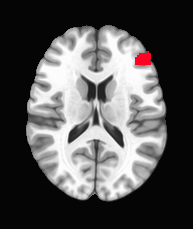
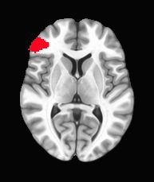
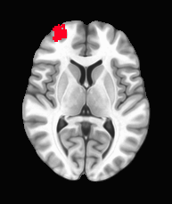
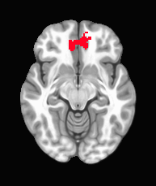
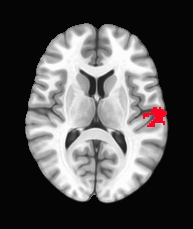
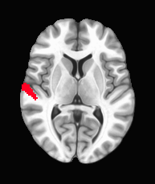
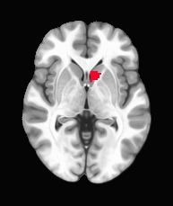
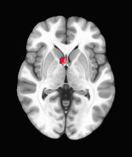
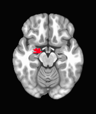

```{r setup, include=FALSE}
knitr::opts_chunk$set(echo = TRUE)
knitr::opts_chunk$set(warning = FALSE)
```

```{r set-options, echo=FALSE, cache=FALSE}
options(width = 300)
```

## Input

Analysis for OHBM 2020 abstract on the temporal dynamics of drug cue reactivity with replication.
## Read Data

```{r}

#function to be able to read in an .RData file and assign it to a variable
loadRData <- function(fileName){
  #loads an RData file, and returns it
  load(fileName)
  get(ls()[ls() != "fileName"])
}

```


```{r}

idps_neurocaps <- loadRData('data/neurocaps/idps-neurocaps-2-13-2020.RData')
idps_neurocaps$motion <- idps_neurocaps$dcr_motaveraw_r1
#remove subjects due to excessive motion
idps_neurocaps <- idps_neurocaps[idps_neurocaps$motion < 0.3 & (!idps_neurocaps$neurocaps_exclude),]
idps_neurocaps_ocr <- idps_neurocaps[idps_neurocaps$dcr_version == 'ocr',]
idps_neurocaps_mcr <- idps_neurocaps[idps_neurocaps$dcr_version == 'mcr',]
idps_tacs <- loadRData('data/tacs/idps-tacs-2-13-2020.RData')
idps_tacs$motion <- idps_tacs$dcr_tpre_motaveraw_r1
idps_tacs <- idps_tacs[idps_tacs$motion < 0.3 & (!idps_tacs$tacs_exclude),]
idps_tdcs <- loadRData('data/tdcs/idps-tdcs-2-13-2020.RData')
idps_tdcs$motion <- idps_tdcs$dcr_tpre_motaveraw_r1
idps_tdcs <- idps_tdcs[idps_tdcs$motion < 0.3 & (!idps_tdcs$tdcs_exclude),]

#only use neurocaps OCR subjects who also did tACS
idps_neurocaps_ocr <- idps_neurocaps_ocr[idps_neurocaps_ocr$id %in% idps_tacs$id,]

#only use tacs subjects with good neurocaps data
idps_tacs <- idps_tacs[idps_tacs$id %in% idps_neurocaps_ocr$id,]

#idps_tacs$dcr_tpre_response_craving_[0-7]
#idp_tdcs
#dcr_tpre_response_box_rt_0
#dcr_tpre_response_craving_rt_0
#idps_neurocaps_ocr$dcr_response_box_craving[0-7]


n_tdcs <- length(unique(idps_tdcs$id))
n_neurocaps_mcr <- length(unique(idps_neurocaps_mcr$id))
n_neurocaps_ocr <- length(unique(idps_neurocaps_ocr$id))
n_tacs <- length(unique(idps_tacs$id))


print('Subjects In Each Dataset')
print('tDCS MCR')
print(n_tdcs)
print('Neurocaps MCR')
print(n_neurocaps_mcr)
print('Neurocaps OCR')
print(n_neurocaps_ocr)
print('tACS OCR')
print(n_tacs)

write.csv(idps_tdcs$id, 'subjects-tdcs.csv', row.names = FALSE)
write.csv(idps_neurocaps_mcr$id, 'subjects-neurocapsMCR.csv', row.names = FALSE)
write.csv(idps_neurocaps_ocr$id, 'subjects-neurocapsOCR.csv', row.names = FALSE)
write.csv(idps_tacs$id, 'subjects-tacs.csv', row.names = FALSE)


#write out behavioral data to share with Hamed/Henry

behavioral_cols <- grepl('response', names(idps_tdcs))
behavioral_cols[names(idps_tdcs) == 'id'] <- TRUE
write.csv(idps_tdcs[, behavioral_cols], 'behavior-tdcs.csv', row.names = FALSE)

behavioral_cols <- grepl('tpre_response', names(idps_tacs))
behavioral_cols[names(idps_tacs) == 'id'] <- TRUE
write.csv(idps_tacs[, behavioral_cols], 'behavior-tacs.csv', row.names = FALSE)

behavioral_cols <- grepl('response', names(idps_neurocaps_mcr))
behavioral_cols[names(idps_neurocaps_mcr) == 'id'] <- TRUE
write.csv(idps_neurocaps_mcr[, behavioral_cols], 'behavior-neurocapsMCR.csv', row.names = FALSE)

behavioral_cols <- grepl('response', names(idps_neurocaps_ocr))
behavioral_cols[names(idps_neurocaps_ocr) == 'id'] <- TRUE
write.csv(idps_neurocaps_ocr[, behavioral_cols], 'behavior-neurocapsOCR.csv', row.names = FALSE)

#idps_tacs <- read.csv('idps-tacs-abstract.csv')
#variable names are:
#for tACS
#dcr_tpre_stats_tdcsprelim_[condition].[run].0.coef_mean_[roi]
#for neurocaps
#dcr_stats_tdcsprelim_[condition].[run].0.coef_mean_[roi]

#conditions are: drug or neutral
#runs are (e.g. run 1 block 1):
#r11, r12, r13, r14

#ROIs are:
#1: VMPFC extracted at p < 0.001
#3: LSTG extracted at p < 0.001
#4: RSTG extracted at p < 0.001
#5: L Ventral Striatum extracted at p < 0.05 intersected with brainnetome ROIs 219 and 223
#6: R Ventral Striatum extracted at p < 0.05 intersected with brainnetome ROIs 220 and 224
#8: R Amygdala extracted at p < 0.05 intersected with brainnetome ROIs 212 and 214
library(reshape2)
library(lme4)
library(lmerTest)
library(ggplot2)
library(sjstats) #for icc of mixed effects models
plot_one <- function(roi, this_label, idps, limits_spag, limits_y = c(-1, 1), prefix = 'dcr_', task = ''){
  #roi <- '1'
  #this_label <- 'VMPFC'
  
  
  #roi <- '1'
  #this_label <- 'VMPFC'
  #prefix <- 'dcr_tpre_'
  #idps <- idps_tdcs
  
  column_prefixes <- c('stats_tdcsprelim_drug.r11.0.coef_mean_',
             'stats_tdcsprelim_drug.r12.0.coef_mean_',
             'stats_tdcsprelim_drug.r13.0.coef_mean_',
             'stats_tdcsprelim_drug.r14.0.coef_mean_',
             'stats_tdcsprelim_neutral.r11.0.coef_mean_',
             'stats_tdcsprelim_neutral.r12.0.coef_mean_',
             'stats_tdcsprelim_neutral.r13.0.coef_mean_',
             'stats_tdcsprelim_neutral.r14.0.coef_mean_')
  this_roi <- c('id', 'motion', paste0(prefix, column_prefixes, roi))
  one_dataset <- idps[, this_roi]
  long_data <- melt(one_dataset, id.vars = c('id', 'motion'))
  long_data$condition <- NA
  long_data$condition[grepl('neutral', long_data$variable)] <- 'neutral'
  long_data$condition[grepl('drug', long_data$variable)] <- 'drug'
  #put neutral in the intercept
  long_data$condition <- factor(long_data$condition, levels = c('neutral', 'drug'))
  long_data$time <- NA
  long_data$time[grepl('r11', long_data$variable)] <- 1
  long_data$time[grepl('r12', long_data$variable)] <- 2
  long_data$time[grepl('r13', long_data$variable)] <- 3
  long_data$time[grepl('r14', long_data$variable)] <- 4

  #mean center on time
  long_data$time <- long_data$time - mean(long_data$time)


  #this_lme <- lmer(paste('value ~ condition * time + (1|id)'), data = long_data)
  #for checking for NA's, looks like it's all good now
  #print(long_data)
  this_lme <- lmer(paste('value ~ condition * time + motion + (1|id/condition)'), data = long_data)
  #print(summary(this_lme))
  within_visit_iccs <- sjstats::icc(this_lme)

  n_subjects <- length(unique(long_data$id))
  means <- aggregate(long_data$value, by = list(long_data$condition, long_data$time), FUN = mean, na.rm = TRUE)
  names(means)[1:2] <- c('condition', 'time')
  sds <- aggregate(long_data$value, by = list(long_data$condition, long_data$time), FUN = sd, na.rm = TRUE)
  names(sds)[1:2] <- c('condition', 'time')


  #print(this_label)
  mean_str <- paste(this_label, '_mean', sep = '')
  names(means)[3] <- mean_str 
  

  sd_str <- paste(this_label, '_sd', sep = '')
  se_str <- paste(this_label, '_se', sep = '')
  names(sds)[3] <- sd_str
  
  plot_frame <- merge(means, sds)
  plot_frame[, se_str] <- plot_frame[, sd_str] / sqrt(n_subjects)
  plot_frame$bar_top <- plot_frame[, mean_str] + plot_frame[, se_str]
  plot_frame$bar_bottom <- plot_frame[, mean_str] - plot_frame[, se_str]
  
  plot_frame$label <- this_label
  
  ebsize <- 1.5
  linesize <- 1
  #swap condition levels back for this plot, so that drug is red and neutral is blue
  plot_frame$condition <- factor(plot_frame$condition, levels = c('drug', 'neutral'))
  p <- ggplot(plot_frame) + geom_line(aes_string(x = 'time', y = mean_str, color = 'condition'), size = linesize) + geom_errorbar(aes_string(x = 'time', ymax = 'bar_top',                                                       ymin = 'bar_bottom', color = 'condition', width = 0.1), size = ebsize) +
                      theme(text = element_text(size=10)) + ggtitle(task) + ylab('') + xlab('') + ylim(limits_y)
  
  #print(p)
  
  
  p2 <- ggplot(data = long_data[long_data$condition == 'drug',], aes_string(x = 'time', y = 'value', group = 'id')) + 
    geom_line() + stat_summary(aes(group = 1), geom = "point", fun.y = mean, shape = 17, size = 3) + 
    stat_smooth(aes(group = 1)) + labs(
    x = "Time",
    y = "% Signal Change",
    title = "drug") 
  #print(p2)
  p3 <- ggplot(data = long_data[long_data$condition == 'neutral',], aes_string(x = 'time', y = 'value', group = 'id')) + 
    geom_line() + stat_summary(aes(group = 1), geom = "point", fun.y = mean, shape = 17, size = 3) + 
    stat_smooth(aes(group = 1)) + labs(
    x = "Time",
    y = "% Signal Change",
    title = "neutral") 
  #print(p3) 
  
  wide_icc_data <- dcast(long_data, id ~ variable)
  within_iccs_simple <- ICC(wide_icc_data[, 2:ncol(wide_icc_data)])
  within_iccs_simple_intervals <- extract_icc_intervals(within_iccs_simple)
  
  
  wide_icc_data_contrasts <- dcast(long_data, id + time ~ condition)
  wide_icc_data_contrasts$DrugvNeutral <- wide_icc_data_contrasts$drug - wide_icc_data_contrasts$neutral
  contrast_icc_data <- dcast(wide_icc_data_contrasts, id ~ time, value.var = 'DrugvNeutral')
  
  contrast_iccs <- ICC(contrast_icc_data[, 2:ncol(contrast_icc_data)])
  within_contrast_icc_intervals <- extract_icc_intervals(contrast_iccs)
  
  
  return(list(model = this_lme, plotframe = plot_frame, p = p, p2=p2, p3=p3, dset = long_data, within_visit_iccs = within_visit_iccs,
              within_iccs_simple_intervals = within_iccs_simple_intervals,
              within_contrast_icc_intervals = within_contrast_icc_intervals))
  
   
}


plot_one_beh <- function(measure, this_label, idps, limits_spag, limits_y = c(1, 4), prefix = 'dcr_', task = ''){
  #same as above, but for behavioral data
  #prefix will be dcr_tpre_ for tdcs/tacs and dcr_ for neurocaps 
  #measure will be box_rt, craving_rt, or craving
  #measure <- 'craving'
  #prefix <- 'dcr_tpre_'
  #this_label <- 'Craving'
  #idps <- idps_tdcs
  
  
  #idps_tacs$dcr_tpre_response_craving_[0-7]
  #idp_tdcs
  #dcr_tpre_response_box_rt_0
  #dcr_tpre_response_craving_rt_0
  #idps_neurocaps_ocr$dcr_response_box_craving[0-7]

  column_suffixes <- 0:7
  
  these_cols <- c('id', paste0(prefix, 'response_', measure, '_', column_suffixes))
  library(reshape2)
  one_dataset <- idps[, these_cols]
  long_data <- melt(one_dataset, id.vars = c('id'))
  long_data$variable <- as.character(long_data$variable)
  long_data$condition <- NA
  long_data$number <- substr(long_data$variable, nchar(long_data$variable), nchar(long_data$variable))
  long_data$condition[long_data$number %in% c('0', '2', '4', '6')] <- 'neutral'
  long_data$condition[long_data$number %in% c('1', '3', '5', '7')] <- 'drug'
  #put neutral in the intercept
  long_data$condition <- factor(long_data$condition, levels = c('neutral', 'drug'))
  #time = block number, just like for the imaging variables
  long_data$time <- NA
  long_data$time[long_data$number %in% c('0', '1')] <- 1
  long_data$time[long_data$number %in% c('2', '3')] <- 2
  long_data$time[long_data$number %in% c('4', '5')] <- 3
  long_data$time[long_data$number %in% c('6', '7')] <- 4

  #mean center on time
  long_data$time <- long_data$time - mean(long_data$time)

  library(lme4)
  library(lmerTest)
  library(ggplot2)
  library(sjstats) #for icc of mixed effects models
  #this_lme <- lmer(paste('value ~ condition * time + (1|id)'), data = long_data)
  #for checking for NA's, looks like it's all good now
  #print(long_data)
  this_lme <- lmer(paste('value ~ condition * time +  (1|id/condition)'), data = long_data)
  #print(summary(this_lme))
  within_visit_iccs <- sjstats::icc(this_lme)

  n_subjects <- length(unique(long_data$id))
  means <- aggregate(long_data$value, by = list(long_data$condition, long_data$time), FUN = mean, na.rm = TRUE)
  names(means)[1:2] <- c('condition', 'time')
  sds <- aggregate(long_data$value, by = list(long_data$condition, long_data$time), FUN = sd, na.rm = TRUE)
  names(sds)[1:2] <- c('condition', 'time')


  #print(this_label)
  mean_str <- paste(this_label, '_mean', sep = '')
  names(means)[3] <- mean_str 
  

  sd_str <- paste(this_label, '_sd', sep = '')
  se_str <- paste(this_label, '_se', sep = '')
  names(sds)[3] <- sd_str
  
  plot_frame <- merge(means, sds)
  plot_frame[, se_str] <- plot_frame[, sd_str] / sqrt(n_subjects)
  plot_frame$bar_top <- plot_frame[, mean_str] + plot_frame[, se_str]
  plot_frame$bar_bottom <- plot_frame[, mean_str] - plot_frame[, se_str]
  
  plot_frame$label <- this_label
  
  ebsize <- 1.5
  linesize <- 1
  #swap condition levels back for this plot, so that drug is red and neutral is blue
  plot_frame$condition <- factor(plot_frame$condition, levels = c('drug', 'neutral'))
  p <- ggplot(plot_frame) + geom_line(aes_string(x = 'time', y = mean_str, color = 'condition'), size = linesize) + geom_errorbar(aes_string(x = 'time', ymax = 'bar_top',                                                       ymin = 'bar_bottom', color = 'condition', width = 0.1), size = ebsize) +
                      theme(text = element_text(size=10)) + ggtitle(task) + ylab('') + xlab('') + ylim(limits_y)
  
  #print(p)
  
  
  p2 <- ggplot(data = long_data[long_data$condition == 'drug',], aes_string(x = 'time', y = 'value', group = 'id')) + 
    geom_line() + stat_summary(aes(group = 1), geom = "point", fun.y = mean, shape = 17, size = 3) + 
    stat_smooth(aes(group = 1)) + labs(
    x = "Time",
    y = this_label,
    title = "drug") 
  #print(p2)
  p3 <- ggplot(data = long_data[long_data$condition == 'neutral',], aes_string(x = 'time', y = 'value', group = 'id')) + 
    geom_line() + stat_summary(aes(group = 1), geom = "point", fun.y = mean, shape = 17, size = 3) + 
    stat_smooth(aes(group = 1)) + labs(
    x = "Time",
    y = this_label,
    title = "neutral") 
  #print(p3) 
  
  wide_icc_data <- dcast(long_data, id ~ variable)
  within_iccs_simple <- ICC(wide_icc_data[, 2:ncol(wide_icc_data)])
  within_iccs_simple_intervals <- extract_icc_intervals(within_iccs_simple)
  
  
  wide_icc_data_contrasts <- dcast(long_data, id + time ~ condition)
  wide_icc_data_contrasts$DrugvNeutral <- wide_icc_data_contrasts$drug - wide_icc_data_contrasts$neutral
  contrast_icc_data <- dcast(wide_icc_data_contrasts, id ~ time, value.var = 'DrugvNeutral')
  
  contrast_iccs <- ICC(contrast_icc_data[, 2:ncol(contrast_icc_data)])
  within_contrast_icc_intervals <- extract_icc_intervals(contrast_iccs)
  
  
  return(list(model = this_lme, plotframe = plot_frame, p = p, p2=p2, p3=p3, dset = long_data, within_visit_iccs = within_visit_iccs,
              within_iccs_simple_intervals = within_iccs_simple_intervals,
              within_contrast_icc_intervals = within_contrast_icc_intervals))
  
   
}


library(sjPlot)
library(grid)
library(gridExtra)
library(ggpubr)
library(psych)

#condition by time interaction
#1: VMPFC extracted at p < 0.001
#3: LSTG extracted at p < 0.001
#4: RSTG extracted at p < 0.001
#5: L Ventral Striatum extracted at p < 0.05 intersected with brainnetome ROIs 219 and 223
#6: R Ventral Striatum extracted at p < 0.05 intersected with brainnetome ROIs 220 and 224
#8: R Amygdala extracted at p < 0.05 intersected with brainnetome ROIs 212 and 214

#main effect of condition
#9: LIFG extracted at p < 0.001
#10: RIFG at p < 0.001
#12: RDLPFC at p < 0.001

extract_icc_intervals <- function(this_icc){
  
  single_absolute <- round(this_icc$results$ICC[1], 3)
  single_absolute_lower <- this_icc$results$`lower bound`[1]
  single_absolute_upper <- this_icc$results$`upper bound`[1]
  single_fixed <- round(this_icc$results$ICC[3], 3)
  single_fixed_lower <- this_icc$results$`lower bound`[3]
  single_fixed_upper <- this_icc$results$`upper bound`[3]
  average_fixed <- round(this_icc$results$ICC[6], 3)
  average_fixed_lower <- this_icc$results$`lower bound`[6]
  average_fixed_upper <- this_icc$results$`upper bound`[6]
  this_row <- data.frame(t(c(ICC1 = single_absolute, ICC1_lower = single_absolute_lower, ICC1_upper = single_absolute_upper, ICC3 = single_fixed,
                             ICC3_lower = single_fixed_lower, ICC3_upper = single_fixed_upper,
                             ICC3k = average_fixed, ICC3k_lower = average_fixed_lower, ICC3k_upper = average_fixed_upper)))
  return(this_row)   
}

compare_models <- function(tdcs_model, neurocaps_mcr_model, neurocaps_ocr_model, tacs_model){
  #prints off tables of z-scores and p-values for the coefficients of condition and condition*time compared between all pairs of models
  #tdcs_summary <- summary(tdcs_model)
  #fill this with z-scores testing for differences between coefficients of different models
  ztable_condition <- data.frame(tdcs=c(NA,NA,NA,NA), neurocaps_mcr = c(NA,NA,NA,NA),
                       neurocaps_ocr = c(NA,NA,NA,NA), tacs=c(NA,NA,NA,NA))
  rownames(ztable_condition) <- c('tdcs', 'neurocaps_mcr', 'neurocaps_ocr', 'tacs')
  
  ztable_conditionbytime <- data.frame(tdcs=c(NA,NA,NA,NA), neurocaps_mcr = c(NA,NA,NA,NA),
                       neurocaps_ocr = c(NA,NA,NA,NA), tacs=c(NA,NA,NA,NA))
  rownames(ztable_conditionbytime) <- c('tdcs', 'neurocaps_mcr', 'neurocaps_ocr', 'tacs')
  
  all_models <- list(summary(tdcs_model), summary(neurocaps_mcr_model), summary(neurocaps_ocr_model), summary(tacs_model))
  for (i in 1:3){
    for (j in (i+1):4){
      #condition beta
      beta1 <- all_models[[i]]$coefficients[2,1]
      #condition SE
      se1 <- all_models[[i]]$coefficients[2,2]
      #condition beta
      beta2 <- all_models[[j]]$coefficients[2,1]
      #condition SE
      se2 <- all_models[[j]]$coefficients[2,2]
      this_z <- (beta1 - beta2) / sqrt(se1 * se1 + se2 * se2)
      ztable_condition[i,j] <- ztable_condition[j,i] <- this_z
      
      
      #conditionbytime beta--row 5 for imaging and 4 for behavioral (since motion is not included there)--but always the last row
      amodel <- all_models[[i]]$coefficients
      cbytime_idx <- nrow(amodel)
      beta1 <- all_models[[i]]$coefficients[cbytime_idx,1]
      #conditionbytime SE
      se1 <- all_models[[i]]$coefficients[cbytime_idx,2]
      #conditionbytime beta
      beta2 <- all_models[[j]]$coefficients[cbytime_idx,1]
      #conditionbytime SE
      se2 <- all_models[[j]]$coefficients[cbytime_idx,2]
      this_z <- (beta1 - beta2) / sqrt(se1 * se1 + se2 * se2)
      ztable_conditionbytime[i,j] <- ztable_conditionbytime[j,i] <- this_z
      
    }
  }
  
  ptable_condition <- ztable_condition
  ptable_conditionbytime <- ztable_conditionbytime
  for (n in names(ptable_condition)){
    ptable_condition[,n] <- 2*pnorm(-abs(ptable_condition[,n]))
    ptable_conditionbytime[,n] <- 2*pnorm(-abs(ptable_conditionbytime[,n]))
  }
  print('###Condition z-scores###')
  print(ztable_condition)
  print('###Condition by time z-scores###')
  print(ztable_conditionbytime)
    
  print('###Condition p-values###')
  print(ptable_condition)
  print('###Condition by time p-values###')
  print(ptable_conditionbytime)
  
  
  
  
  
}
  


plot_combination <- function(roi, label, limits_spag = c(-2,2), limits_y = c(-1, 1), imaging = TRUE, forest_range = c(-0.5, 0.5)){

  #roi <- '9'
  #label <- 'LIFG'
  #limits_y = c(-0.3, 0.5)
  #limits_spag = c(-2, 2)
  
  if (imaging){
    tdcs_list <- plot_one(roi, label, idps_tdcs, limits_spag = limits_spag, limits_y = limits_y, prefix = 'dcr_tpre_', task = '1212MCR')
    neurocaps_mcr_list <- plot_one(roi, label, idps_neurocaps_mcr, limits_spag = limits_spag, limits_y = limits_y, prefix = 'dcr_', task = 'WiRMCR')
    neurocaps_ocr_list <- plot_one(roi, label, idps_neurocaps_ocr, limits_spag = limits_spag, limits_y = limits_y, prefix = 'dcr_', task = '1212OCR')
    tacs_list <- plot_one(roi, label, idps_tacs, limits_spag = limits_spag, limits_y = limits_y, prefix = 'dcr_tpre_', task = '1212OCR2')
  } else {
    tdcs_list <- plot_one_beh(roi, label, idps_tdcs, limits_spag = limits_spag, limits_y = limits_y, prefix = 'dcr_tpre_', task = '1212MCR')
    neurocaps_mcr_list <- plot_one_beh(roi, label, idps_neurocaps_mcr, limits_spag = limits_spag, limits_y = limits_y, prefix = 'dcr_', task = 'WiRMCR')
    neurocaps_ocr_list <- plot_one_beh(roi, label, idps_neurocaps_ocr, limits_spag = limits_spag, limits_y = limits_y, prefix = 'dcr_', task = '1212OCR')
    tacs_list <- plot_one_beh(roi, label, idps_tacs, limits_spag = limits_spag, limits_y = limits_y, prefix = 'dcr_tpre_', task = '1212OCR2')
  }
  compare_models(tdcs_list$model, neurocaps_mcr_list$model, neurocaps_ocr_list$model, tacs_list$model)
  
  
  #print model with restricted range
  print(plot_models(tdcs_list$model, neurocaps_mcr_list$model, neurocaps_ocr_list$model, tacs_list$model, m.labels = c('tDCS', 'WirMCR', '1212OCR', '1212OCR2')) + ylim(forest_range))
  #plot model without restricting range so you can see where 'motion' falls
  print(plot_models(tdcs_list$model, neurocaps_mcr_list$model, neurocaps_ocr_list$model, tacs_list$model, m.labels = c('tDCS', 'WirMCR', '1212OCR', '1212OCR2')))# + ylim(-0.5, 0.5))
  
  #from:
  #https://stats.stackexchange.com/questions/93540/testing-equality-of-coefficients-from-two-different-regressions
  #to test for a difference in betas, compute:
  #Z = (beta1 - beta2)/sqrt(SE(beta1)^2 + SE(beta2)^2)
  pwidth = 6
  pheight = 8
  print(ggarrange(tdcs_list$p, neurocaps_mcr_list$p, neurocaps_ocr_list$p, tacs_list$p, ncol = 2, nrow = 2, common.legend = TRUE, legend = 'bottom'))
  ggsave(paste0(label, '-lineplot.png') , ggarrange(tdcs_list$p, neurocaps_mcr_list$p, neurocaps_ocr_list$p, tacs_list$p, ncol = 2, nrow = 2, 
                                                    common.legend = TRUE, legend = 'bottom'),
         width = pwidth, height = pheight)
  print(ggarrange(tdcs_list$p2, neurocaps_mcr_list$p2, neurocaps_ocr_list$p2, tacs_list$p2, ncol = 2, nrow = 2, common.legend = TRUE, legend = 'bottom'))
  
  print(ggarrange(tdcs_list$p3, neurocaps_mcr_list$p3, neurocaps_ocr_list$p3, tacs_list$p3, ncol = 2, nrow = 2, common.legend = TRUE, legend = 'bottom'))
  
  
  #get ICCs for each of the 8 conditions
  icc_data <- merge(neurocaps_ocr_list$dset, tacs_list$dset, by = c('id', 'time', 'condition'))
  all_iccs <- NULL
  mean_values <- NA
  for (con in unique(icc_data$condition)){
    for (tim in unique(icc_data$time)){
      
      for_icc <- icc_data[icc_data$time == tim & icc_data$condition == con, c('value.x', 'value.y')]
      this_icc <- ICC(for_icc)
      this_row <- extract_icc_intervals(this_icc)
      this_row$var <- paste(tim, con)      
      all_iccs <- rbind(all_iccs, this_row)
      
      #get values for drug and neutral at this time point to put into mean_values frame
      for_means <- icc_data[icc_data$time == tim & icc_data$condition == con, c('id', 'value.x', 'value.y')]
      value_cols <- paste0(con, tim, c('NeuroCaps', 'tACS'))
      names(for_means) <- c('id', value_cols)
      mean_values <- merge(mean_values, for_means, all = TRUE)
      
    }
    #get ICCs for mean of drug and neutral
    for_icc <- icc_data[icc_data$condition == con, c('id', 'value.x', 'value.y')]
    for_icc <- aggregate(for_icc[, c('value.x', 'value.y')], by = list(for_icc$id), FUN = mean)
    value_cols <- paste0(con, c('NeuroCaps', 'tACS'))
    names(for_icc) <- c('id', value_cols)
    mean_values <- merge(mean_values, for_icc, all = TRUE)
    this_icc <- ICC(for_icc[, value_cols])
    this_row <- extract_icc_intervals(this_icc)
    this_row$var <- paste(con)      
    all_iccs <- rbind(all_iccs, this_row)
  }
  
  for (tim in unique(icc_data$time)){
    neurocaps_colname <- paste0('NeuroCapsDvN', tim)
    tacs_colname <- paste0('tACSDvN', tim)
    mean_values[, neurocaps_colname] <- mean_values[, paste0('drug', tim, 'NeuroCaps')] - mean_values[, paste0('neutral', tim, 'NeuroCaps')]
    mean_values[, tacs_colname] <- mean_values[, paste0('drug', tim, 'tACS')] - mean_values[, paste0('neutral', tim, 'tACS')]
    this_icc <- ICC(mean_values[, c(neurocaps_colname, tacs_colname)])
    this_row <- extract_icc_intervals(this_icc)
    this_row$var <- paste0(tim, 'DrugvNeutral')      
    all_iccs <- rbind(all_iccs, this_row)
  }

  #get early and late mean values
  mean_values$NeuroCapsDvNEarly <- (mean_values$`NeuroCapsDvN-1.5` + mean_values$`NeuroCapsDvN-0.5`) / 2
  mean_values$NeuroCapsDvNLate <- (mean_values$`NeuroCapsDvN1.5` + mean_values$`NeuroCapsDvN0.5`) / 2
  
  mean_values$tACSDvNEarly <- (mean_values$`tACSDvN-1.5` + mean_values$`tACSDvN-0.5`) / 2
  mean_values$tACSDvNLate <- (mean_values$`tACSDvN1.5` + mean_values$`tACSDvN0.5`) / 2
  
  #compute early and late ICCs
  this_icc <- ICC(mean_values[, c('NeuroCapsDvNEarly', 'tACSDvNEarly')])
  this_row <- extract_icc_intervals(this_icc)
  this_row$var <- paste('DrugvNeutralEarly')      
  all_iccs <- rbind(all_iccs, this_row)
  
  this_icc <- ICC(mean_values[, c('NeuroCapsDvNLate', 'tACSDvNLate')])
  this_row <- extract_icc_intervals(this_icc)
  this_row$var <- paste('DrugvNeutralLate')      
  all_iccs <- rbind(all_iccs, this_row)
  
  
  
  mean_values$NeuroCapsDvN <- mean_values$drugNeuroCaps - mean_values$neutralNeuroCaps
  mean_values$tACSDvN <- mean_values$drugtACS - mean_values$neutraltACS
  
  this_icc <- ICC(mean_values[, c('NeuroCapsDvN', 'tACSDvN')])
  this_row <- extract_icc_intervals(this_icc)
  this_row$var <- paste('DrugvNeutral')      
  all_iccs <- rbind(all_iccs, this_row)
  
  #get ICCs for mean contrast of drug and neutral in each block and in blocks 1/2 and 3/4 separately
  
  
  
  melted_iccs <- all_iccs[, c('var', 'ICC1', 'ICC1_lower', 'ICC1_upper')]
  names(melted_iccs) <- c('var', 'ICC', 'lower', 'upper')
  melted_iccs$variable <- 'ICC1'

  melted_iccs3 <- all_iccs[, c('var', 'ICC3', 'ICC3_lower', 'ICC3_upper')]
  names(melted_iccs3) <- c('var', 'ICC', 'lower', 'upper')
  melted_iccs3$variable <- 'ICC3'
  
  melted_iccs <- rbind(melted_iccs, melted_iccs3)
  #melted_iccs$var <- factor(melted_iccs$var, levels = rev(to_plot))
  melted_iccs$var <- factor(melted_iccs$var, levels = c('DrugvNeutral', 'drug', 'neutral',
                                                        "DrugvNeutralLate", "DrugvNeutralEarly",
                                                        "-1.5DrugvNeutral", "-0.5DrugvNeutral",  "0.5DrugvNeutral",   "1.5DrugvNeutral",
                                                           '1.5 drug', '0.5 drug', '-0.5 drug', '-1.5 drug',
                                                           '1.5 neutral', '0.5 neutral', '-0.5 neutral', '-1.5 neutral'))
  p <- ggplot(melted_iccs) + geom_bar(aes(x = var, fill = variable, y = ICC), stat = 'identity', position = 'dodge') + coord_flip() +
    xlab('Variable') + ylab('ICC') + ggtitle(paste0('Between Session: ', label)) + geom_errorbar(aes(x = var, fill = variable, ymin = lower, ymax = upper), stat = 'identity', position = 'dodge')
  print(p)
  print(all_iccs)
  ggsave(paste0('ICCs_', label, '.png'), p)
  
  
  #plot ICCs that come from the LME
  within_icc_results <- as.data.frame(rbind(tdcs_list$within_visit_iccs, neurocaps_mcr_list$within_visit_iccs, neurocaps_ocr_list$within_visit_iccs, tacs_list$within_visit_iccs))
  within_icc_results$dset <- c('tDCS', 'WirMCR', '1212OCR', '1212OCR2')
  within_icc_results$id_condition <- within_icc_results$id + within_icc_results$`condition:id`
  melted_within_data <- melt(within_icc_results, id.vars = c('dset', 'condition:id'))
  melted_within_data$dset <- factor(melted_within_data$dset, levels = c('1212OCR',  '1212OCR2','WirMCR', 'tDCS'))
  p <- ggplot(data = melted_within_data) + geom_bar(aes(x = dset, y = value, color = variable, fill = variable), stat = 'identity', position = 'dodge') +
    coord_flip() + ggtitle(paste0('Within Session ICCs from LME for: ', label))
  print(p)
  
  #plot within-session ICCs from psych's ICC function, treating all conditions as the same (should be similar to 'id' above)
  tdcs_list$within_iccs_simple_intervals$var <- 'tDCS'
  all_iccs <- tdcs_list$within_iccs_simple_intervals
  neurocaps_mcr_list$within_iccs_simple_intervals$var <- 'WirMCR'
  all_iccs <- rbind(all_iccs, neurocaps_mcr_list$within_iccs_simple_intervals)
  neurocaps_ocr_list$within_iccs_simple_intervals$var <- '1212OCR'
  all_iccs <- rbind(all_iccs, neurocaps_ocr_list$within_iccs_simple_intervals)
  tacs_list$within_iccs_simple_intervals$var <- '1212OCR2'
  all_iccs <- rbind(all_iccs, tacs_list$within_iccs_simple_intervals)
  
  ###plot--should functionalize this
  melted_iccs <- all_iccs[, c('var', 'ICC1', 'ICC1_lower', 'ICC1_upper')]
  names(melted_iccs) <- c('var', 'ICC', 'lower', 'upper')
  melted_iccs$variable <- 'ICC1'

  melted_iccs3 <- all_iccs[, c('var', 'ICC3', 'ICC3_lower', 'ICC3_upper')]
  names(melted_iccs3) <- c('var', 'ICC', 'lower', 'upper')
  melted_iccs3$variable <- 'ICC3'
  
  melted_iccs3k <- all_iccs[, c('var', 'ICC3k', 'ICC3k_lower', 'ICC3k_upper')]
  names(melted_iccs3k) <- c('var', 'ICC', 'lower', 'upper')
  melted_iccs3k$variable <- 'ICC3k'
  
  melted_iccs <- rbind(melted_iccs, melted_iccs3)
  melted_iccs <- rbind(melted_iccs, melted_iccs3k)
  #melted_iccs$var <- factor(melted_iccs$var, levels = rev(to_plot))
  melted_iccs$var <- factor(melted_iccs$var, levels = c('1212OCR2',  '1212OCR','WirMCR', 'tDCS'))
  p <- ggplot(melted_iccs) + geom_bar(aes(x = var, fill = variable, y = ICC), stat = 'identity', position = 'dodge') + coord_flip() +
    xlab('Variable') + ylab('ICC') + ggtitle(paste0('Within Session Simple ICC: ', label)) + geom_errorbar(aes(x = var, fill = variable, ymin = lower, ymax = upper), stat = 'identity', position = 'dodge')
  print(p)
  
  
  #plot within-session ICCs from psych's ICC function, using contrasts
  tdcs_list$within_contrast_icc_intervals$var <- 'tDCS'
  all_iccs <- tdcs_list$within_contrast_icc_intervals
  neurocaps_mcr_list$within_contrast_icc_intervals$var <- 'WirMCR'
  all_iccs <- rbind(all_iccs, neurocaps_mcr_list$within_contrast_icc_intervals)
  neurocaps_ocr_list$within_contrast_icc_intervals$var <- '1212OCR'
  all_iccs <- rbind(all_iccs, neurocaps_ocr_list$within_contrast_icc_intervals)
  tacs_list$within_contrast_icc_intervals$var <- '1212OCR2'
  all_iccs <- rbind(all_iccs, tacs_list$within_contrast_icc_intervals)
  
  ###plot--should functionalize this
  melted_iccs <- all_iccs[, c('var', 'ICC1', 'ICC1_lower', 'ICC1_upper')]
  names(melted_iccs) <- c('var', 'ICC', 'lower', 'upper')
  melted_iccs$variable <- 'ICC1'

  melted_iccs3 <- all_iccs[, c('var', 'ICC3', 'ICC3_lower', 'ICC3_upper')]
  names(melted_iccs3) <- c('var', 'ICC', 'lower', 'upper')
  melted_iccs3$variable <- 'ICC3'
  
  melted_iccs3k <- all_iccs[, c('var', 'ICC3k', 'ICC3k_lower', 'ICC3k_upper')]
  names(melted_iccs3k) <- c('var', 'ICC', 'lower', 'upper')
  melted_iccs3k$variable <- 'ICC3k'
  
  melted_iccs <- rbind(melted_iccs, melted_iccs3)
  melted_iccs <- rbind(melted_iccs, melted_iccs3k)
  #melted_iccs$var <- factor(melted_iccs$var, levels = rev(to_plot))
  melted_iccs$var <- factor(melted_iccs$var, levels = c('1212OCR2',  '1212OCR','WirMCR', 'tDCS'))
  p <- ggplot(melted_iccs) + geom_bar(aes(x = var, fill = variable, y = ICC), stat = 'identity', position = 'dodge') + coord_flip() +
    xlab('Variable') + ylab('ICC') + ggtitle(paste0('Within Session Contrast ICC: ', label)) + geom_errorbar(aes(x = var, fill = variable, ymin = lower, ymax = upper), stat = 'identity', position = 'dodge')
  print(p)
  
  ###
  
  
  
  
  print('###tDCS MCR###')
  print(summary(tdcs_list$model))
  #print(anova(tdcs_list$model, type = 'marginal'))
  print('###Neurocaps MCR###')
  print(summary(neurocaps_mcr_list$model))
  print('###Neurocaps OCR###')
  print(summary(neurocaps_ocr_list$model))
  print('###tACS OCR###')
  print(summary(tacs_list$model))
  
  
  ##make model output table to save
  tablefile <- paste0(label, '-modeltable.csv')
  write.table('tDCS Model Output', tablefile)
  write.table(round(summary(tdcs_list$model)$coefficients, digits = 3), file = tablefile,
            row.names = TRUE, append = TRUE, sep = ',')
  
  write.table('Neurocaps MCR Model Output', tablefile, append = TRUE)
  write.table(round(summary(neurocaps_mcr_list$model)$coefficients, digits = 3), file = tablefile,
            row.names = TRUE, append = TRUE, sep = ',')
  
  write.table('Neurocaps OCR Model Output', tablefile, append = TRUE)
  write.table(round(summary(neurocaps_ocr_list$model)$coefficients, digits = 3), file = tablefile,
            row.names = TRUE, append = TRUE, sep = ',')
  
  write.table('tACS OCR Model Output', tablefile, append = TRUE)
  write.table(round(summary(tacs_list$model)$coefficients, digits = 3), file = tablefile,
            row.names = TRUE, append = TRUE, sep = ',')
  
  
}


```

## Condition

###LIFG


```{r}



plot_combination('9', 'LIFG', limits_y = c(-0.15, 0.45))


```

###RIFG


```{r}



plot_combination('10', 'RIFG', limits_y = c(-0.15, 0.5))

```

###RDLPFC

```{r}



plot_combination('12', 'RDLPFC', limits_y = c(-0.45, 0.1))

```


## ConditionXTime

### VMPFC

```{r}



plot_combination('1', 'VMPFC', limits_y = c(-0.4, 0.5))

```

### LSTG

```{r}



plot_combination('3', 'LSTG', limits_y = c(-0.5, 0.3))

```


### RSTG

```{r}



plot_combination('4', 'RSTG', limits_y = c(-0.4, 0.25))

```

### LVStriatum

```{r}



plot_combination('5', 'LVSTRI', limits_y = c(-0.22, 0.35))

```

### RVStriatum

```{r}



plot_combination('6', 'RVSTRI', limits_y = c(-0.2, 0.3))

```

### RAmy

```{r}



plot_combination('8', 'RAmy', limits_y = c(-0.05, 0.75))

```


## Self-Report and RTs

### Craving

```{r}

plot_combination('craving', 'Craving', limits_y = c(1, 4), imaging = FALSE, forest_range = c(-0.5, 2.5))

```

### Craving RT

```{r}

plot_combination('craving_rt', 'CravingRT', limits_y = c(1, 3.5), imaging = FALSE)

```

### Box RT

```{r}

plot_combination('box_rt', 'CravingRT', limits_y = c(0.5, 3.5), imaging = FALSE)

```

```{r}
extract_slopes_beh <- function(measure, this_label, idps, prefix = 'dcr_'){
  #same as above, but for behavioral data
  #prefix will be dcr_tpre_ for tdcs/tacs and dcr_ for neurocaps 
  #measure will be box_rt, craving_rt, or craving
  #measure <- 'craving'
  #prefix <- 'dcr_tpre_'
  #this_label <- 'Craving'
  #idps <- idps_tdcs
  
  
  #idps_tacs$dcr_tpre_response_craving_[0-7]
  #idp_tdcs
  #dcr_tpre_response_box_rt_0
  #dcr_tpre_response_craving_rt_0
  #idps_neurocaps_ocr$dcr_response_box_craving[0-7]

  column_suffixes <- 0:7
  
  these_cols <- c('id', paste0(prefix, 'response_', measure, '_', column_suffixes))
  library(reshape2)
  one_dataset <- idps[, these_cols]
  long_data <- melt(one_dataset, id.vars = c('id'))
  long_data$variable <- as.character(long_data$variable)
  long_data$condition <- NA
  long_data$number <- substr(long_data$variable, nchar(long_data$variable), nchar(long_data$variable))
  long_data$condition[long_data$number %in% c('0', '2', '4', '6')] <- 'neutral'
  long_data$condition[long_data$number %in% c('1', '3', '5', '7')] <- 'drug'
  #put neutral in the intercept
  long_data$condition <- factor(long_data$condition, levels = c('neutral', 'drug'))
  #time = block number, just like for the imaging variables
  long_data$time <- NA
  long_data$time[long_data$number %in% c('0', '1')] <- 1
  long_data$time[long_data$number %in% c('2', '3')] <- 2
  long_data$time[long_data$number %in% c('4', '5')] <- 3
  long_data$time[long_data$number %in% c('6', '7')] <- 4

  #mean center on time
  long_data$time <- long_data$time - mean(long_data$time)

  library(lme4)
  library(lmerTest)
  library(ggplot2)
  library(sjstats) #for icc of mixed effects models
  
  
  
  all_results <- NULL
  for (this_id in unique(long_data$id)){  
    #this_id <- 'AR316'
    this_sub_data <- long_data[long_data$id == this_id,]
    neutral_string <- paste0(this_label, '_slopeNeutral')
    meth_string <- paste0(this_label, '_slopeMeth')
    delta_string <- paste0(this_label, '_slopeMethMinusNeutral')
    if (sum(!(is.na(this_sub_data$value[this_sub_data$condition == 'neutral']))) > 1 &
        sum(!(is.na(this_sub_data$value[this_sub_data$condition == 'drug']))) > 1){
      #subject made at least two ratings per condition
      this_lm <- lm(paste('value ~ condition * time'), data = this_sub_data)
      
      these_results <- data.frame(list(id = this_id, neutral_string = this_lm$coefficients['time'],
                                meth_string = this_lm$coefficients['time'] + this_lm$coefficients['conditiondrug:time'],
                                delta_string = this_lm$coefficients['conditiondrug:time']))
      names(these_results) <- c('id', neutral_string, meth_string, delta_string)
      
    } else{
      #not enough ratings to estimate two slopes
      these_results <- data.frame(list(id = this_id, neutral_string = NA,
                                meth_string = NA,
                                delta_string = NA))
      names(these_results) <- c('id', neutral_string, meth_string, delta_string)

        }
    all_results <- rbind(all_results, these_results)
  }
  

  return(all_results)
   
}


```

### Corrplot including individual slopes and self-report

```{r}


  
extract_one_slopes <- function( roi = '1', this_label = 'VMPFC', prefix = 'dcr_tpre_', idps = idps_tdcs){
  column_prefixes <- c('stats_tdcsprelim_drug.r11.0.coef_mean_',
           'stats_tdcsprelim_drug.r12.0.coef_mean_',
           'stats_tdcsprelim_drug.r13.0.coef_mean_',
           'stats_tdcsprelim_drug.r14.0.coef_mean_',
           'stats_tdcsprelim_neutral.r11.0.coef_mean_',
           'stats_tdcsprelim_neutral.r12.0.coef_mean_',
           'stats_tdcsprelim_neutral.r13.0.coef_mean_',
           'stats_tdcsprelim_neutral.r14.0.coef_mean_')
  this_roi <- c('id', 'motion', paste0(prefix, column_prefixes, roi))
  one_dataset <- idps[, this_roi]
  long_data <- melt(one_dataset, id.vars = c('id', 'motion'))
  long_data$condition <- NA
  long_data$condition[grepl('neutral', long_data$variable)] <- 'neutral'
  long_data$condition[grepl('drug', long_data$variable)] <- 'drug'
  #put neutral in the intercept
  long_data$condition <- factor(long_data$condition, levels = c('neutral', 'drug'))
  long_data$time <- NA
  long_data$time[grepl('r11', long_data$variable)] <- 1
  long_data$time[grepl('r12', long_data$variable)] <- 2
  long_data$time[grepl('r13', long_data$variable)] <- 3
  long_data$time[grepl('r14', long_data$variable)] <- 4
  #mean center on time
  long_data$time <- long_data$time - mean(long_data$time)
  
  #this_lme <- lmer(paste('value ~ condition * time + (1|id)'), data = long_data)
  #for checking for NA's, looks like it's all good now
  #print(long_data)
  all_results <- NULL
  for (this_id in unique(long_data$id)){  
    #this_id <- 'AR316'
    this_lm <- lm(paste('value ~ condition * time + motion'), data = long_data[long_data$id == this_id,])
    neutral_string <- paste0(this_label, '_slopeNeutral')
    meth_string <- paste0(this_label, '_slopeMeth')
    delta_string <- paste0(this_label, '_slopeMethMinusNeutral')
    these_results <- data.frame(list(id = this_id, neutral_string = this_lm$coefficients['time'],
                                meth_string = this_lm$coefficients['time'] + this_lm$coefficients['conditiondrug:time'],
                                delta_string = this_lm$coefficients['conditiondrug:time']))
    names(these_results) <- c('id', neutral_string, meth_string, delta_string)
    all_results <- rbind(all_results, these_results)
  }
  
  

  return(all_results)
}


all_slopes <- extract_one_slopes('1', 'VMPFC', prefix = 'dcr_tpre_', idps = idps_tdcs)
all_slopes <- merge(all_slopes, extract_one_slopes('3', 'LSTG', prefix = 'dcr_tpre_', idps = idps_tdcs))
all_slopes <- merge(all_slopes, extract_one_slopes('4', 'RSTG', prefix = 'dcr_tpre_', idps = idps_tdcs))
all_slopes <- merge(all_slopes, extract_one_slopes('5', 'LVSTRI', prefix = 'dcr_tpre_', idps = idps_tdcs))
all_slopes <- merge(all_slopes, extract_one_slopes('6', 'RVSTRI', prefix = 'dcr_tpre_', idps = idps_tdcs))
all_slopes <- merge(all_slopes, extract_one_slopes('8', 'RAmy', prefix = 'dcr_tpre_', idps = idps_tdcs))


vas_data <- read.csv('data/MethVASData.csv')
vas_data <- vas_data[, c('record_id', 'redcap_event_name', 'mcs_vas', 'mcs_vas_2')]

names(vas_data) <- c('id', 'visit', 'craving', 'control')

library(reshape2)
vas_data_1 <- vas_data[vas_data$visit == 'before_pre_fmri_arm_1', c('id', 'craving', 'control')]
vas_data_2 <- vas_data[vas_data$visit == 'after_pre_fmri_arm_1', c('id', 'craving', 'control')]

vas_data_wide <- merge(vas_data_1, vas_data_2, by = 'id')

names(vas_data_wide) <- c('id', 'craving_pre', 'control_pre', 'craving_post', 'control_post')
vas_data_wide$craving_delta <- vas_data_wide$craving_post - vas_data_wide$craving_pre
vas_data_wide$control_delta <- vas_data_wide$control_post - vas_data_wide$control_pre

merged_data <- merge(all_slopes, vas_data_wide, all.x = TRUE)


last_use_data <- read.csv('data/ADUQ_2019-06-12_1407.csv')
merged_data <- merge(merged_data, last_use_data[, c('id', 'aduq_20a')], all.x = TRUE)
names(merged_data)[names(merged_data) == 'aduq_20a'] <- 'DaysSinceLastUse'


tableone_data <- read.csv('data/Table1Database66_ver2.csv')
merged_data <- merge(merged_data, tableone_data, all.x = TRUE)

idps_tdcs$methvsneutral_craving_selfreport_insidescanner <- (idps_tdcs$dcr_tpre_response_craving_1 + idps_tdcs$dcr_tpre_response_craving_3 +
  idps_tdcs$dcr_tpre_response_craving_5 + idps_tdcs$dcr_tpre_response_craving_7 - 
    idps_tdcs$dcr_tpre_response_craving_0 - idps_tdcs$dcr_tpre_response_craving_2 - idps_tdcs$dcr_tpre_response_craving_4 - idps_tdcs$dcr_tpre_response_craving_6) / 4


merged_data <- merge(merged_data, extract_slopes_beh('craving', 'Craving', idps_tdcs, prefix = 'dcr_tpre_'), all.x = TRUE)

merged_data <- merge(merged_data, idps_tdcs[, c('id', 'methvsneutral_craving_selfreport_insidescanner')])
names(merged_data)
names(merged_data)[names(merged_data) == 'Meth.Cue.Reactivity.Screening.score..0.100.'] <- 'BaselineCueReactivity'
names(merged_data)[names(merged_data) == 'Duration.of.Meth.use.at.least.once.a.week..years.'] <- 'MethUseDuration'
names(merged_data)[names(merged_data) == 'Cost.of.Meth..dollar.per.month.'] <- 'MethCost'

names(merged_data)[names(merged_data) == 'craving_post'] <- 'Craving_post'
names(merged_data)[names(merged_data) == 'craving_pre'] <- 'Craving_pre'
names(merged_data)[names(merged_data) == 'craving_delta'] <- 'Craving_delta'

to_plot <- c('Age', 'MethUseDuration', 'MethCost',"DaysSinceLastUse",
            'BaselineCueReactivity',  "Craving_pre", "Craving_post", "Craving_delta",
            "VMPFC_slopeNeutral", "VMPFC_slopeMeth",  "VMPFC_slopeMethMinusNeutral",
            "LSTG_slopeNeutral", "LSTG_slopeMeth","LSTG_slopeMethMinusNeutral",
            "RSTG_slopeNeutral", "RSTG_slopeMeth", "RSTG_slopeMethMinusNeutral",
            "LVSTRI_slopeNeutral", "LVSTRI_slopeMeth", "LVSTRI_slopeMethMinusNeutral",
            "RVSTRI_slopeNeutral", "RVSTRI_slopeMeth", "RVSTRI_slopeMethMinusNeutral",
            "RAmy_slopeNeutral", "RAmy_slopeMeth", "RAmy_slopeMethMinusNeutral")

to_plot <- c('Age', 'MethUseDuration', 'MethCost',"DaysSinceLastUse",
            "Craving_pre", "Craving_post", "Craving_delta", 
            'methvsneutral_craving_selfreport_insidescanner',
            'Craving_slopeMethMinusNeutral',
            "VMPFC_slopeMethMinusNeutral",
            "LSTG_slopeMethMinusNeutral",
            "RSTG_slopeMethMinusNeutral",
            "LVSTRI_slopeMethMinusNeutral",
            "RVSTRI_slopeMethMinusNeutral",
            "RAmy_slopeMethMinusNeutral")

library(corrplot)
this_matrix <- cor(merged_data[, to_plot], use = 'pairwise.complete.obs')
pvals_raw <- cor.mtest(merged_data[, to_plot])

#get FDR corrected p-values to use for plotting
pvals_fdr <- pvals_raw$p
pvals_fdr[upper.tri(pvals_fdr)] <- p.adjust(pvals_raw$p[upper.tri(pvals_raw$p)])
pvals_fdr[lower.tri(pvals_fdr)] <- p.adjust(pvals_raw$p[lower.tri(pvals_raw$p)])


col2 <- colorRampPalette(rev(c("#67001F", "#B2182B", "#D6604D", "#F4A582",
                           "#FDDBC7", "#FFFFFF", "#D1E5F0", "#92C5DE",
                           "#4393C3", "#2166AC", "#053061")))


png('corrplot_slopes_sxs.png', width = 1000, height = 1000)
corrplot.mixed(this_matrix, upper = 'ellipse', lower = 'number', tl.pos = 'lt', tl.cex = 1,#, lower.col = "black",
  upper.col = col2(50), lower.col = col2(50), p.mat = pvals_fdr, sig.level = 0.05)
dev.off()

```


